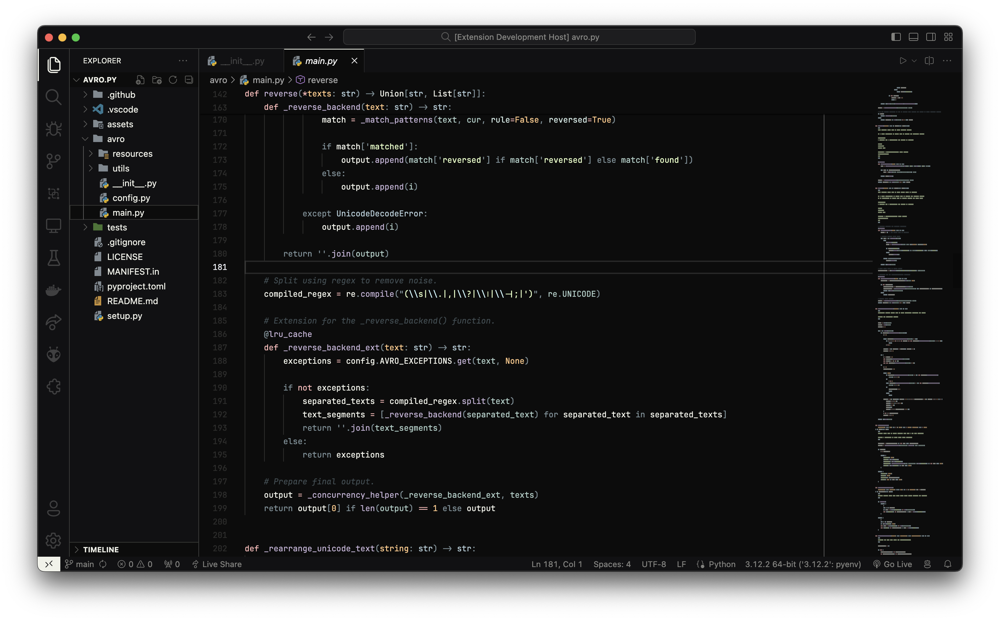

<div align="center">

# Gloam: VSCode Theme
### ✨ A soft, yet charming VSCode theme that goes easy on your eyes.


<br>

[](https://github.com/hitblast/Gloam/actions/workflows/build.yml)

<br>

</div>

## 🌟 Features

- **Warm Tone**: A soft, warm color palette that's suitable for long, coding hours.
- **High Contrast**: Makes it easy to read and write code.
- **Universal**: Works well with most languages and file types.
- **Open-source**: Feel free to contribute and make it better!

<br>

## ⚡ Preview

Below is a preview of the theme in action. Feel free to have a look beforehand!

(Project shown in the preview: [avro.py](https://github.com/hitblast/avro.py))



## 🔨 Installation

### Marketplace
1. Open the Extensions sidebar in VS Code. View → Extensions
2. Search for: `exthitblast.gloam`
3. Click on "Install" and voila!

### Command-line
1. Download the latest release artifacts (`.vsix` files) from either the [GitHub Releases](https://github.com/hitblast/Gloam/releases) section or the [GitHub Actions](https://github.com/hitblast/Gloam/actions) page.
2. Install the extension by running the following command:
```bash
$ code --install-extension gloam-*.vsix
```
3. Or, you can simply skip the first step and install the extension directly (marketplace CLI):
```bash
$ code --install-extension exthitblast.gloam
```

## 🔖 License

This project is licensed under the MIT License - see the [LICENSE](LICENSE) file for details.