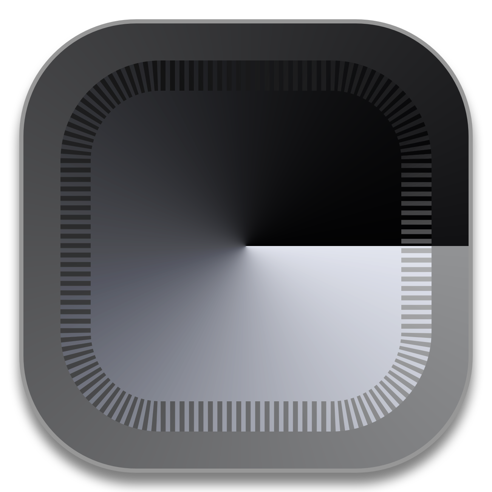

# Gloam: VSCode Theme
### ✨ A soft, yet charming VSCode theme that goes easy on your eyes.

<code>
$ code --install-extension exthitblast.gloam
$ code --install-extension gloam-0.0.1.vsix
</code>

 

